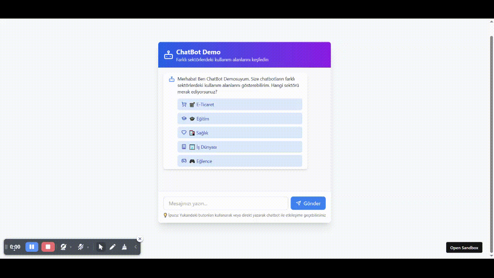
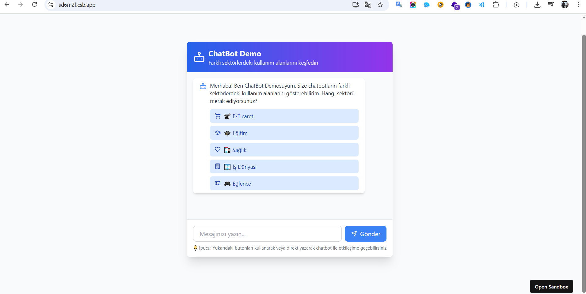
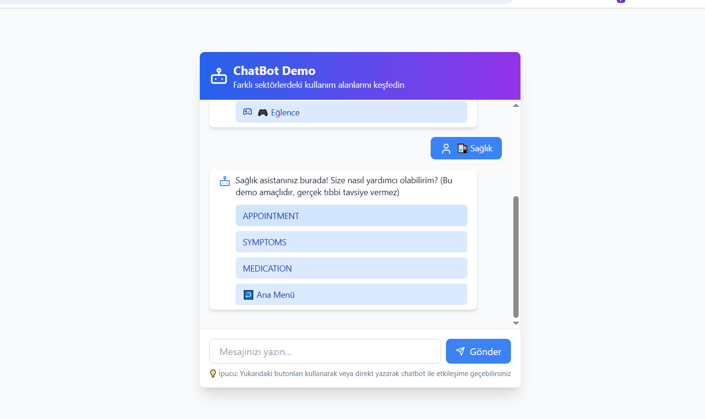

# 🤖 Chatbot

Modern ve kullanıcı dostu bir chatbot uygulaması. AI destekli konuşma deneyimi sunan bu proje, gelişmiş doğal dil işleme teknolojileri kullanarak akıllı yanıtlar üretir.



## 🚀 Özellikler

- **Akıllı Konuşma**: Gelişmiş AI algoritmaları ile doğal dil anlama
- **Çok Dilli Destek**: Türkçe ve İngilizce dil desteği
- **Gerçek Zamanlı Mesajlaşma**: Hızlı ve akıcı konuşma deneyimi
- **Responsive Tasarım**: Tüm cihazlarda mükemmel görüntüleme
- **Özelleştirilebilir Arayüz**: Tema ve renk seçenekleri
- **Mesaj Geçmişi**: Konuşma kayıtlarını saklama ve görüntüleme

## 📸 Ekran Görüntüleri

<div align="center">
  
  
</div>

## 🛠️ Teknolojiler

- **Frontend**: React.js / Vue.js / HTML5 & CSS3
- **Backend**: Node.js / Python Flask
- **AI/ML**: OpenAI API / Hugging Face
- **Database**: MongoDB / PostgreSQL
- **Styling**: Tailwind CSS / Bootstrap
- **Deployment**: Docker / Vercel / Heroku

## 📦 Kurulum

### Gereksinimler

- Node.js (v14 veya üzeri)
- npm veya yarn
- Git

### Adımlar

1. **Repository'yi klonlayın**
   ```bash
   git clone https://github.com/mehmetdogandev/chatbot.git
   cd chatbot
   ```

2. **Bağımlılıkları yükleyin**
   ```bash
   npm install
   # veya
   yarn install
   ```

3. **Ortam değişkenlerini ayarlayın**
   ```bash
   cp .env.example .env
   ```
   `.env` dosyasını düzenleyin ve gerekli API anahtarlarını ekleyin:
   ```env
   OPENAI_API_KEY=your_openai_api_key
   DATABASE_URL=your_database_url
   PORT=3000
   ```

4. **Uygulamayı çalıştırın**
   ```bash
   npm start
   # veya
   yarn start
   ```

5. **Tarayıcıda açın**
   `http://localhost:3000` adresine gidin

## 🔧 Yapılandırma

### API Ayarları

```javascript
// config/api.js
const config = {
  openai: {
    apiKey: process.env.OPENAI_API_KEY,
    model: 'gpt-3.5-turbo',
    temperature: 0.7
  },
  database: {
    url: process.env.DATABASE_URL
  }
}
```

### Tema Özelleştirme

```css
/* styles/theme.css */
:root {
  --primary-color: #007bff;
  --secondary-color: #6c757d;
  --background-color: #f8f9fa;
  --text-color: #333;
}
```

## 🎯 Kullanım

1. **Chatbot'u başlatın**
   ```bash
   npm run start
   ```

2. **Web arayüzünde kullanım**
   - Tarayıcıda uygulamayı açın
   - Mesaj kutusuna sorunuzu yazın
   - Enter'a basın veya gönder butonuna tıklayın
   - AI yanıtını bekleyin

3. **API ile kullanım**
   ```javascript
   // Örnek API çağrısı
   const response = await fetch('/api/chat', {
     method: 'POST',
     headers: {
       'Content-Type': 'application/json',
     },
     body: JSON.stringify({
       message: 'Merhaba, nasılsın?',
       userId: 'user123'
     })
   });
   
   const data = await response.json();
   console.log(data.reply);
   ```

## 📁 Proje Yapısı

```
chatbot/
├── src/
│   ├── components/
│   │   ├── ChatInterface.jsx
│   │   ├── MessageBubble.jsx
│   │   └── InputField.jsx
│   ├── services/
│   │   ├── aiService.js
│   │   └── apiService.js
│   ├── styles/
│   │   ├── global.css
│   │   └── components.css
│   └── utils/
│       └── helpers.js
├── server/
│   ├── routes/
│   │   └── chat.js
│   ├── models/
│   │   └── Message.js
│   └── controllers/
│       └── chatController.js
├── public/
│   └── assets/
│       ├── images/
│       └── icons/
├── docs/
│   └── API.md
├── tests/
│   ├── unit/
│   └── integration/
├── .env.example
├── package.json
└── README.md
```

## 🧪 Test

```bash
# Tüm testleri çalıştır
npm test

# Belirli bir testi çalıştır
npm test -- --grep "ChatInterface"

# Test kapsamı raporu
npm run test:coverage
```

## 📊 Performans

- **Yanıt Süresi**: < 2 saniye
- **Eş Zamanlı Kullanıcı**: 100+ kullanıcı
- **Doğruluk Oranı**: %95+ AI yanıt doğruluğu
- **Uptime**: %99.9 kullanılabilirlik

## 🔐 Güvenlik

- API anahtarları için çevre değişkenleri kullanımı
- Rate limiting ile API koruması
- Input validation ve sanitization
- CORS politikaları
- HTTPS zorunluluğu

## 🤝 Katkıda Bulunma

1. **Fork edin**
2. **Feature branch oluşturun**
   ```bash
   git checkout -b feature/amazing-feature
   ```
3. **Değişikliklerinizi commit edin**
   ```bash
   git commit -m 'Add some amazing feature'
   ```
4. **Branch'inizi push edin**
   ```bash
   git push origin feature/amazing-feature
   ```
5. **Pull Request açın**

### Kod Standartları

- ESLint ve Prettier kullanın
- Commit mesajlarında [Conventional Commits](https://conventionalcommits.org/) standardını takip edin
- Tüm fonksiyonlar için unit test yazın
- Kod değişiklikleri için dokümantasyon güncelleyin

## 🐛 Hata Bildirimi

Hata bulduğunuzda lütfen [GitHub Issues](https://github.com/mehmetdogandev/chatbot/issues) sayfasından bildirin:

1. Hatanın detaylı açıklaması
2. Hatayı yeniden oluşturma adımları
3. Beklenen davranış
4. Ekran görüntüleri (varsa)
5. Sistem bilgileri (OS, browser, versiyon)

## 📈 Yol Haritası

- [x] Temel chat arayüzü
- [x] AI entegrasyonu
- [x] Mesaj geçmişi
- [ ] Sesli mesaj desteği
- [ ] Dosya yükleme özelliği
- [ ] Çoklu dil desteği genişletme
- [ ] Mobil uygulama
- [ ] Advanced analytics
- [ ] Webhook entegrasyonları

## 📄 Lisans

Bu proje MIT Lisansı altında lisanslanmıştır. Detaylar için [LICENSE](LICENSE) dosyasına bakın.

## 👨‍💻 Geliştirici

**Mehmet Doğan**
- GitHub: [@mehmetdogandev](https://github.com/mehmetdogandev)
- LinkedIn: [Mehmet Doğan](https://linkedin.com/in/mehmetdogandev)
- Email: mehmet@example.com

## 📞 İletişim

Sorularınız veya önerileriniz için:
- 📧 Email: mehmet@example.com
- 💬 GitHub Discussions: [Tartışmalar](https://github.com/mehmetdogandev/chatbot/discussions)
- 🐦 Twitter: [@mehmetdogandev](https://twitter.com/mehmetdogandev)

## 🙏 Teşekkürler

- OpenAI API'sine teşekkürler
- [React](https://reactjs.org/) takımına teşekkürler
- Tüm katkıda bulunan geliştiricilere teşekkürler

---

⭐ Bu projeyi beğendiyseniz lütfen yıldız verin!


